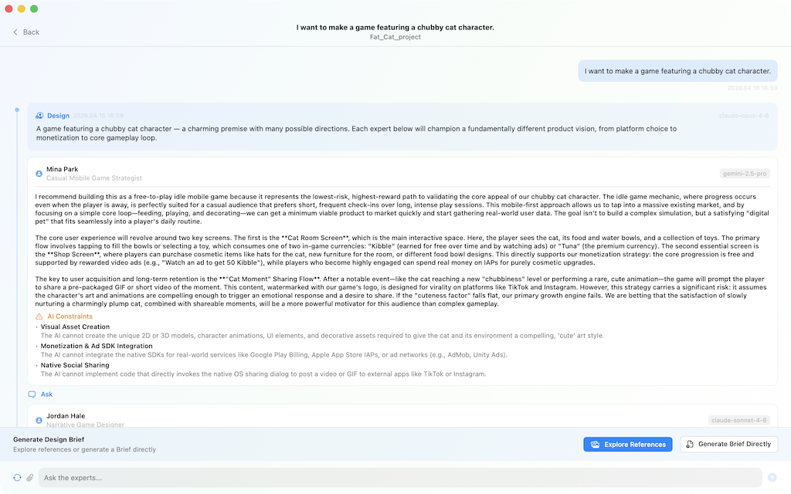
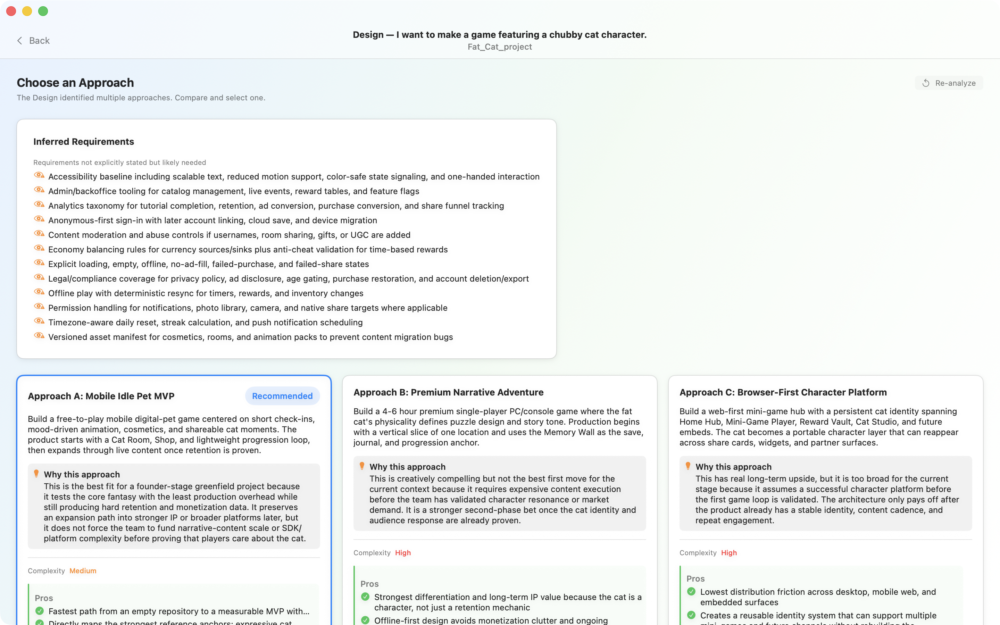
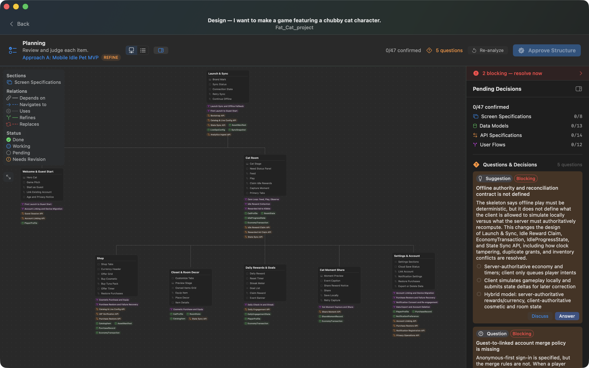
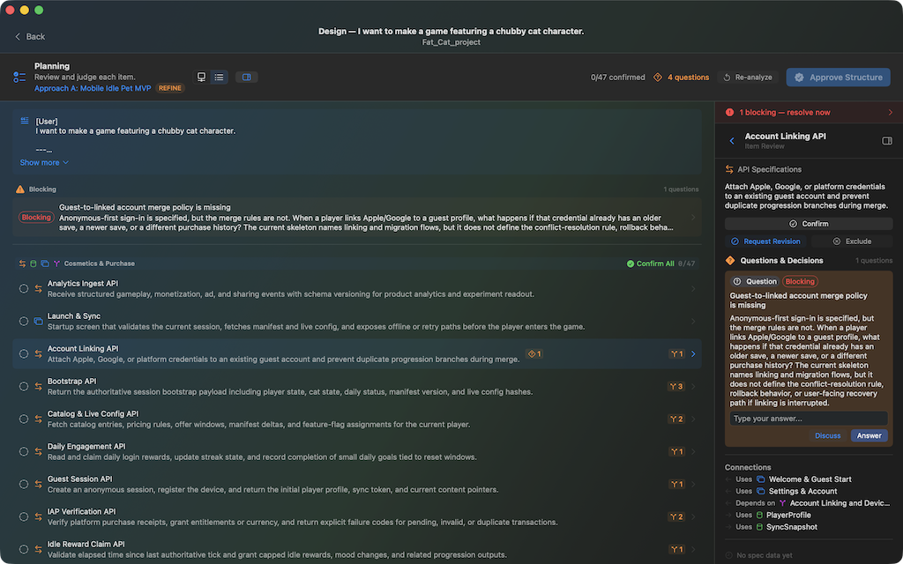

[English](README.md) | 한국어

# LAO macOS App


LAO는 SwiftUI로 만든 macOS 네이티브 AI 디자인 워크플로우 앱이다. CLI 기반 AI 에이전트를 통해 아이디어를 AI 실행 친화적인 설계 문서로 변환한다.

---

## 스크린샷

| IdeaBoard | 접근 방식 선택 |
|:---:|:---:|
|  |  |
| AI 전문가 패널이 아이디어를 탐색 | 여러 접근 방식을 나란히 비교 |

| Planning — Work Graph | Planning — 상세와 의사결정 |
|:---:|:---:|
|  |  |
| 설계 구조를 시각화 | 스펙을 파고들고 질문을 해결 |

---

## 기능

### Design Workflow (핵심 기능)
- AI 기반 설계 구조화: 아이디어 탐색, 접근 방식 선택, 산출물 상세화
- 다단계 실행: Input → Analyzing → Approach Selection → Planning → Completed
- 핵심 분기점마다 사용자 의사결정(Human-in-the-loop)
- 백그라운드 실행과 알림
- Design session 영속화와 이어서 작업 재개

### IdeaBoard (메인 허브)
- AI 전문가 패널과 함께 아이디어 탐색
- 방향 수렴(Synthesis)과 Work Graph 추출
- 아이디어에서 디자인 워크플로우로 매끄럽게 전환

### 프로젝트 관리
- 멀티 프로젝트 워크스페이스와 런처
- 에이전트 설정 (Director, Fallback, Step 티어)
- 프로바이더 지원: Claude, Codex, Gemini
- 프로젝트별 스킬 관리

---

## 아키텍처

### 디렉토리 구조

```
LAO/
├── project.yml                        # XcodeGen spec
├── Package.swift                      # SPM 패키지 정의
├── LAOApp/                            # SwiftUI 애플리케이션
│   ├── App/
│   │   ├── LAOApp.swift               # @main 진입점 (멀티윈도우 Scene API)
│   │   ├── AppContainer.swift         # DI 컨테이너
│   │   ├── LAOAppDelegate.swift       # App delegate
│   │   ├── DesignDocumentWindowCoordinator.swift  # 디자인 문서 창 라이프사이클
│   │   ├── ProjectWindowRoute.swift   # 창 라우팅
│   │   ├── LAOWindowLayoutMode.swift  # 창 크기
│   │   └── DemoSeedMode.swift         # 데모/시드 데이터
│   ├── Features/
│   │   ├── Design/                    # 디자인 워크플로우 (메인 기능)
│   │   │   ├── DesignModels.swift             # 데이터 모델, enum
│   │   │   ├── DesignPromptBuilder.swift      # LLM 프롬프트 템플릿
│   │   │   ├── DesignWorkflowViewModel.swift  # 상태 관리, 실행 엔진
│   │   │   ├── DesignWorkflowView.swift       # 메인 UI (phase별 화면)
│   │   │   ├── ActiveWorkflowCoordinator.swift # 백그라운드 라이프사이클, 프로젝트 큐
│   │   │   └── ...                            # 오버레이, 컨버터, 밸리데이터
│   │   ├── IdeaBoard/                 # 아이디어 관리 허브
│   │   │   ├── IdeaBoardView.swift
│   │   │   ├── IdeaDetailView.swift
│   │   │   ├── IdeaPromptBuilder.swift
│   │   │   └── IdeaBoardModels.swift
│   │   ├── Launcher/                  # 프로젝트 런처 및 워크스페이스
│   │   ├── ProjectDashboard/          # 프로젝트 설정 (General, Agents, Skills)
│   │   └── SharedUI/                  # 테마, 컴포넌트, 버튼 스타일
│   └── ViewModels/                    # 공용 ViewModel
├── Packages/
│   ├── LAODomain/       # 도메인 모델, enum, 프로토콜
│   ├── LAOServices/     # 서비스 프로토콜 정의
│   ├── LAOPersistence/  # SQLite CRUD, 스키마 부트스트랩
│   ├── LAORuntime/      # CLI 에이전트 실행, git, 모델 카탈로그
│   ├── LAOProviders/    # 프로바이더 레지스트리
│   └── LAOMCPServer/    # MCP 서버 실행 파일
```

### 핵심 패턴

- **멀티윈도우 아키텍처**: Scene API 기반 창 (Launcher, ProjectWorkspace, Settings, DesignDocument)
- **ActiveWorkflowCoordinator**: 백그라운드 디자인 실행, 프로젝트 단위 큐잉, ViewModel 라이프사이클을 관리하는 싱글톤
- **DesignPromptBuilder**: 모든 LLM 인터랙션의 프롬프트 구성을 중앙화
- **AppContainer**: 모든 서비스를 보유한 의존성 주입 컨테이너

---

## 빌드 & 실행

### 필수 조건
- macOS 15.0+ (Sequoia)
- Xcode 16.0+
- XcodeGen (`brew install xcodegen`)

### 설정
1. Xcode 프로젝트 생성:
   ```bash
   xcodegen generate
   ```
2. Xcode에서 `LAO.xcodeproj` 열기
3. `LAO` 스킴 선택 후 실행

### CLI 빌드
```bash
xcodebuild -project LAO.xcodeproj -scheme LAO -destination 'platform=macOS' build
```

### AI 프로바이더 설정
Settings → Agents 에서 최소 하나의 CLI 에이전트 프로바이더를 설정한다:
- **Claude**: `claude` CLI가 PATH에 있어야 함
- **Codex**: `codex` CLI가 PATH에 있어야 함
- **Gemini**: `gemini` CLI가 PATH에 있어야 함

---

## 데이터 저장소

- SQLite 데이터베이스: `~/Library/Application Support/LAO/`
- 디자인 문서: 요청별로 `{project_root}/.lao/{ideaId}/{requestId}/`에 저장

---

## 문서

- [LAO가 해결하는 문제](docs/why-lao.ko.md) — LAO가 만들어진 이유
- [운영 원칙](docs/operating-principles.ko.md) — 워크플로우 phase, 역할, 산출물 구조
- [설계 원칙](docs/design-principles.ko.md) — 디자인 품질 기준

## 기여

버그 리포트와 기능 요청은 [GitHub Issues](../../issues)로 환영합니다.
자세한 내용은 [CONTRIBUTING.md](CONTRIBUTING.md) 참고. 현재 Pull Request는 받지 않습니다.

## 보안

보안 취약점은 [SECURITY.md](SECURITY.md)에 기술된 절차를 따라 주세요 — public issue로 올리지 마세요.

## 라이선스

MIT 라이선스로 배포됩니다. 자세한 내용은 [LICENSE](LICENSE)를 참고하세요.
