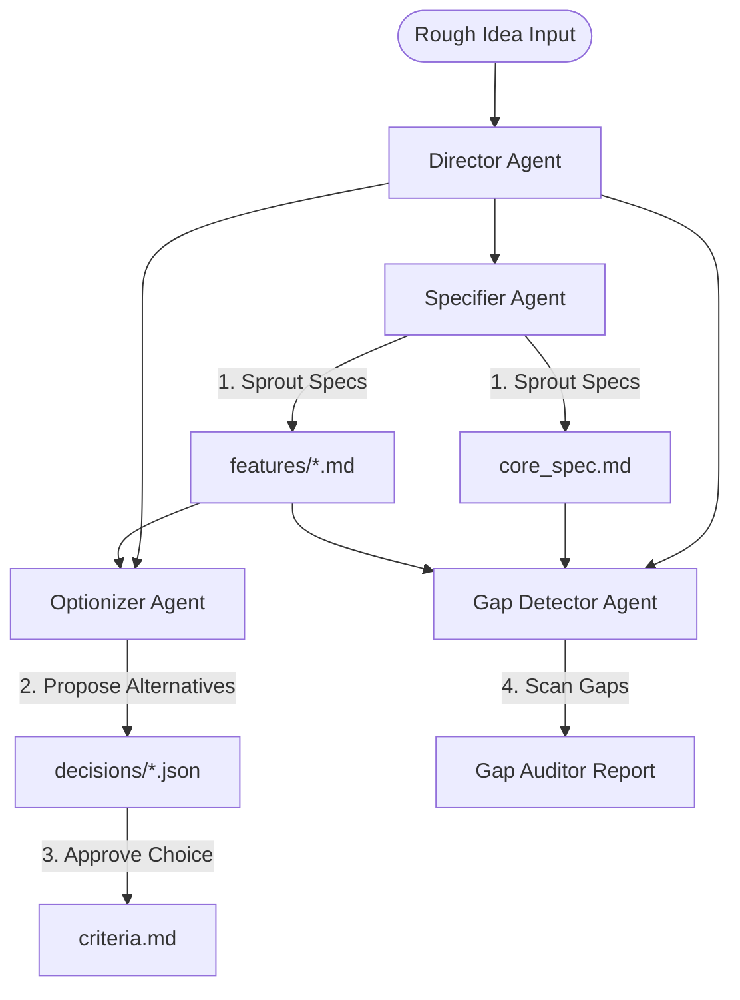

# LAO v0.9 Architecture Documentation

This document explains the architectural principles, file-system structures, and operational workflows of **LAO v0.9**, focusing on the pivot from a visual mindmap representation to a **document-driven guided planning workspace**.

---

## 1. Design Philosophy

The primary objective of v0.9 is to **minimize cognitive fatigue** for the developer while **preventing code-spec divergence**. 

To achieve this, we transitioned from a manual, node-by-node mindmap graph editor to an **automated autopilot with supervised control gates**:
1. **Autopilot Intake**: The developer enters a rough idea, and the AI agents sprout the core specification and feature sets in the background.
2. **Decision Forks (Intervention)**: Instead of micromanaging the graph, the developer acts as a supervisor, approving high-level option cards (e.g., SQLite vs PostgreSQL) that steer the automatic generation.
3. **Guardrails (Golden Rules)**: Design decisions are constrained by strict technology presets injected into all agent contexts.
4. **Lock-to-Code Phase Gate**: The specification is locked down before codegen begins to prevent the AI from drifting away from the approved requirements.

---

## 2. Directory & Storage Layout

All project configurations, specifications, decisions, and chat logs are stored as clean, versionable files in the `.lao/` directory:

```text
.lao/
├── lao.config.json           # Project settings, golden rules, phase, & provider configs
├── criteria.md               # Chronological log of approved decisions & rationales
├── spec_compiled.md          # Combined core & active feature specifications
├── messages.json             # Chat history with the multi-agent office
├── specs/
│   ├── core_spec.md          # Base architecture and technology stack
│   └── features/
│       ├── [feature_1].md    # Active feature specifications (with YAML-like frontmatter)
│       └── [feature_2].md
└── decisions/
    ├── [decision_1].json     # Pending or decided Decision Cards proposed by Optionizer
    └── [decision_2].json
```

### Specification Frontmatter Format
Feature specifications are standard markdown files with a YAML-like header:
```markdown
---
id: auth_system
title: User Authentication System
status: active
createdAt: 2026-05-26T06:50:00Z
updatedAt: 2026-05-26T06:51:00Z
---
# Requirement Details
...
```

---

## 3. The Multi-Agent Collaboration Loop

The workspace utilizes specialized AI agent personas that collaborate on the specification:



### Enforcing Golden Rules
When the `Specifier` or `Optionizer` are invoked, their prompt templates dynamically inject the `goldenRules` defined in `lao.config.json`. This keeps all proposals aligned with the developer's desired technologies (e.g. enforcing "SQLite only, no Docker").

---

## 4. Phase Lock (Planning -> Development)

To prevent code and specification drift, the system enforces a strict phase-lock protocol:
* **Planning Phase**: The specifications are fully editable (either via inline editing in the Web UI or by editing the markdown files under `.lao/specs/` directly). Option cards can be resolved.
* **Development Phase**: The specifications are locked to a read-only state. The coding agent reads `spec_compiled.md` and begins generation. To modify specifications, the user must unlock the planning phase, stopping the coding loop.

---

## 5. Technical Implementation Details

### 5.1 JSON Mode Parser Stability
When using local AI CLI tools (especially `gemini`) in `--output-format json` mode:
1. The raw CLI output encapsulates the model's response within a JSON string field named `"response"`:
   ```json
   {
     "response": "{\n  \"coreSpec\": \"...\",\n  \"features\": [...]\n}"
   }
   ```
2. Simply unescaping this `"response"` field and passing it directly to `JSON.parse()` can fail if the inner string contains raw, unescaped newlines or control characters.
3. The parser in [gemini.ts](file:///Users/mini/LeewayStudio/project/LSOS_project/repo_lao/cli/src/gemini.ts#L360-L370) resolves this double-serialization issue by:
   * Locating and extracting the `"response"` string field.
   * Parsing the inner JSON payload.
   * Re-serializing it back using `JSON.stringify(innerJson)` to automatically escape all raw newlines and formatting characters before passing it to the Orchestrator's parser.

### 5.2 Mobile Responsive Scroll Boundaries
The Web UI adopts viewport scroll boundaries and min-height layouts to accommodate small viewports (e.g. mobile 375x667 screens) and prevent content trapping:
1. **Vertical Flex Layout**: Under small screen dimensions, the split-screen dashboard switches from side-by-side flex columns to a single-column stacked layout (`flex-col`).
2. **Min-Height Rules**: Columns have explicit minimum heights (`min-h-[450px]` and `min-h-[550px]`) to ensure forms, decision cards, and textareas do not collapse or overlap.
3. **Viewport Scroll Limits**: Layout elements utilize CSS viewport scroll boundaries, delegating scrolling to the outer `<main>` container instead of trapping the cursor inside fixed inner panels.

